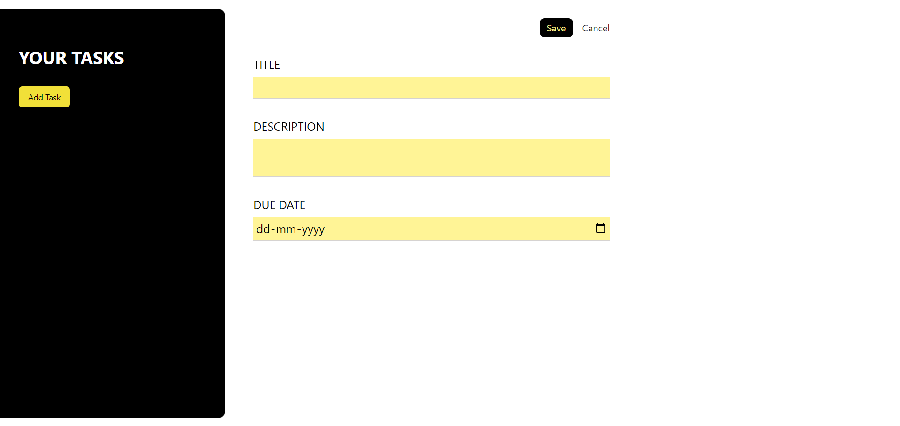
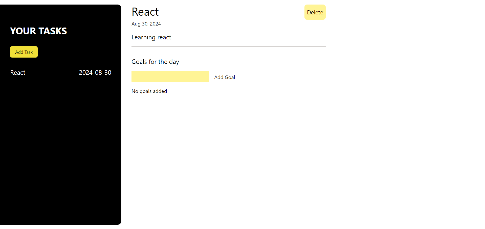
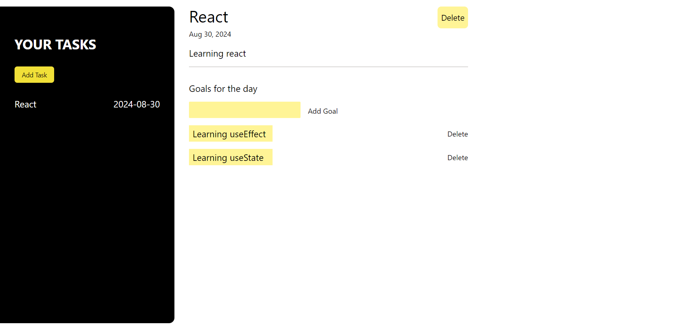

# Task Management App

## Table of Content

* [Overview of the Project](#overview-of-the-project)
* [Whats The Approach](#whats-the-approach)
* [Technologies I Used](#technologies-i-used)
* [Screenshot](#screenshot)
 
 
# Overview of the Project

A Task Managment App is a tool designed to track and organize your task and able to manage task and set goals for that task. This project is made with React + TypeScript and styled using Tailwind CSS.

## Whats The Approach

1. First I created the sidebar where all the task which I created will be seen and I can also add task from there with a button.

2. Second I created the input component where i will add the title, description and due date for the task to be completed and a save button to save the task.

3. Before that I want to show a screen when no task is selected so I created a component to show no task selected and added and a button to add a task. I also added a task Id value to add ids to the task created to select and manage them more easily.

4. After this, I updated the Save button to save the task and display it on the sidebar.

5. The problem which I faced was I wanted to show a error modal when any of the input fields where left empty so for that I used refs and for passing them down to children component and use them in the parent component i used forwardRefs which helps to use certain values which are passed down as props and using useimperativehandle helped me to use certain methods on that parent component which are passed down as props.

6. I also used portals which helped me to seperate the modal from the parent DOM by using another div and it makes it easy for styling the component.

7. Now after this I updated the UI by displaying the title, description and due date and also added a goal component to add goals for that particular task.

8. Also added the delete button to delete a particular goal or a particular task.

## Technologies I Used

* React
* TypeScript
* Tailwind CSS

## Screenshot

